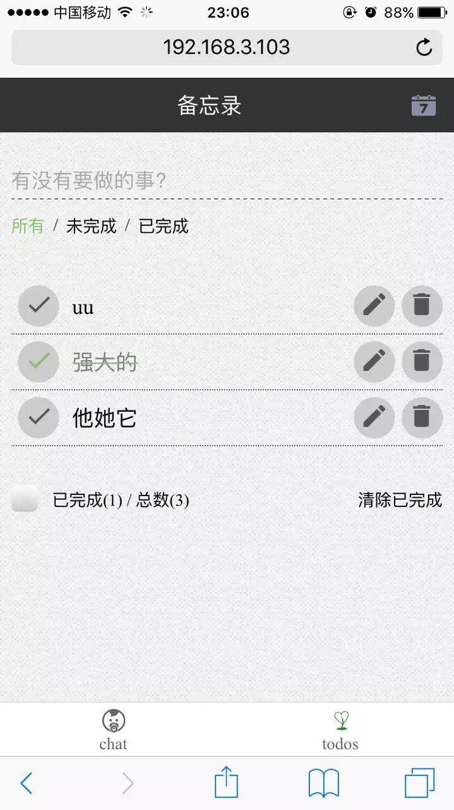

A [React](https://facebook.github.io/react/index.html)_[Sails](http://sailsjs.org) webApp

demo：http://react-sails.herokuapp.com/

功能：聊天室+React Todos  

Sails是一款Node.js的MVC框架，可以很容易地开发定制的，企业级的  
和现代的Node.js应用程序，也适合于开发图表，仪表盘和游戏。  

步骤：  
`npm install -g sails webpack`  
`cd react_sails`  
`cd client`  
`npm install`  
`npm start`  
`cd ../server`  
`npm install`  
`npm install -g nodemon`  
`nodemon`

open 127.0.0.1:1337

  

  

